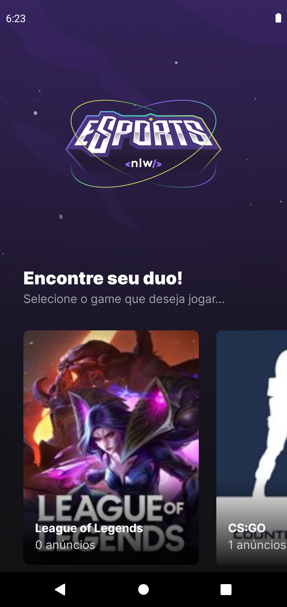
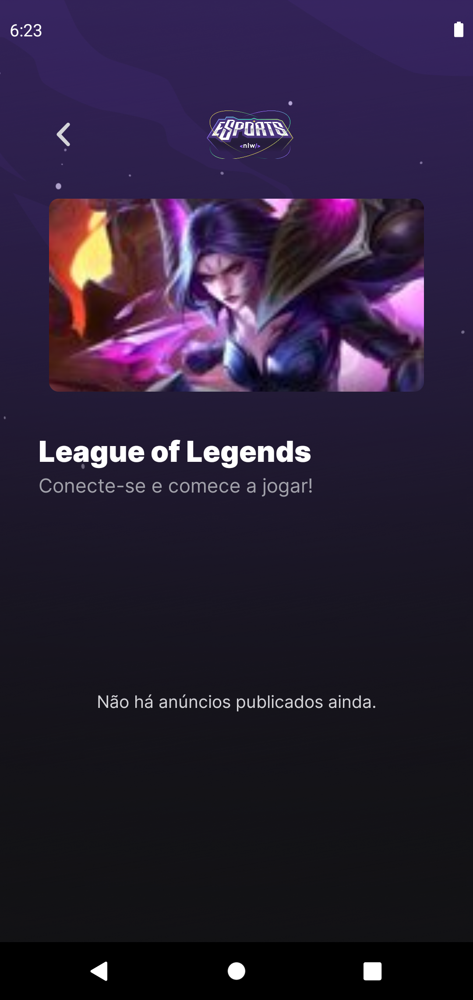
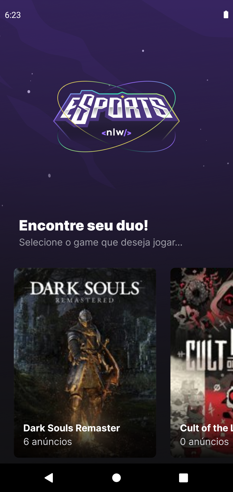
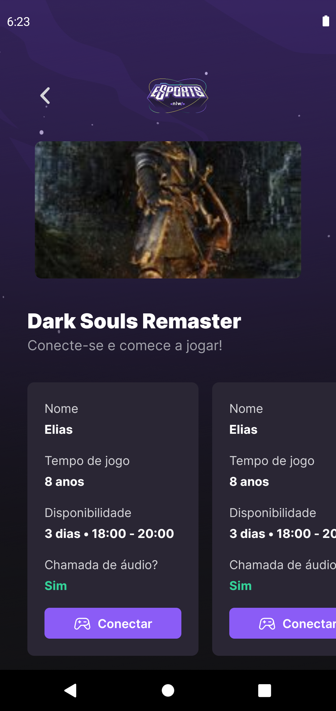

<h1 align="center">
    
</h1>

<h4 align="center"> 
  🚀 Application developed during the NLW by Rocketseat 🚀
</h4>

<p align="center">
  	
  
	
  <a href="https://github.com/EliasJuk/nlw-esports/commits/master">
    
  </a>
  
  <a href="https://github.com/EliasJuk/nlw-esports/issues">
    
  </a>
  
  
<p>

---

<h1 align="center">
    
</h1>

---

<h1 align="center">
    
    
    
    
</h1>

<p>&nbsp;</p>

## :rocket: Technologies

This project was developed with the following technologies:

- [Node.js](https://nodejs.org/en/) 
- [React](https://reactjs.org)
- [React Native](https://facebook.github.io/react-native/)
- [Expo](https://expo.io/)
- [VITE](https://vitejs.dev/)
- [TAILWINDCSS](https://tailwindcss.com/)
- [PHOSPHOR ICONS](https://phosphoricons.com/)
- [REACTNAVIGATION](https://reactnavigation.org/)
- [PRISMA](https://www.prisma.io/)
- [RADIX](https://www.radix-ui.com/)
- [Expo Svg](https://docs.expo.dev/versions/latest/sdk/svg/)

---

### ❕ Install API

```bash
# Run Back-end
$ npm run dev

# Run Web
$ npm run dev

# Run Mobile - Emulador Android Studio
$ npm run android


# BACK-END
# Migrations
$ npx prisma migrate dev

# Migrations Preview
$ npx prisma studio
```

---

## :memo: License

This project is under the MIT license. See the [LICENSE](LICENSE) for details.